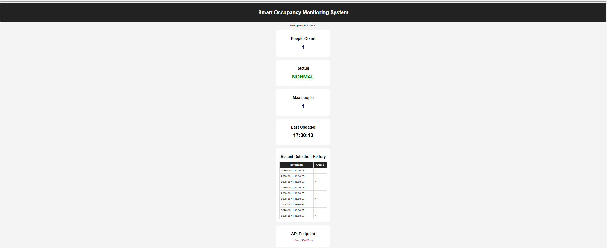

# Smart Occupancy Monitoring System

A real-time occupancy monitoring system built using YOLOv8, OpenCV, Flask, and Python.

The system detects people through a webcam, tracks occupancy levels, generates crowd alerts, stores detection logs, captures evidence screenshots, and displays live statistics through a web dashboard.

---

## Dashboard Preview



## Features

- Real-time people detection using YOLOv8
- Confidence threshold filtering
- Occupancy counting
- Crowd status monitoring (NORMAL / CROWDED)
- Maximum occupancy tracking
- Screenshot evidence capture
- CSV detection logging
- Flask dashboard
- REST API endpoint
- Detection history table
- Auto-refresh dashboard

---

## Technologies Used

- Python
- YOLOv8 (Ultralytics)
- OpenCV
- Flask
- REST API
- HTML/CSS
- Docker

---

## System Architecture

```text
Webcam
   ↓
YOLOv8 Detection
   ↓
People Counting
   ↓
Occupancy Data
   ↓
Flask API
   ↓
Dashboard
```

---

## Dashboard Features

### Live Occupancy Monitoring

- Current People Count
- Occupancy Status
- Maximum Occupancy
- Last Updated Time

### Detection History

- Timestamp
- People Count
- Recent Detection Records

### REST API

Endpoint:

```text
/api/status
```

Example Response:

```json
{
  "people_count": "2",
  "status": "NORMAL",
  "max_people": "5"
}
```

---

## Installation

### Clone Repository

```bash
git clone <your-repository-url>
cd occupancy-monitor
```

### Install Dependencies

```bash
pip install -r requirements.txt
```

### Run Occupancy Detector

```bash
python detect.py
```

### Run Dashboard

```bash
python app.py
```

Open:

```text
http://localhost:5000
```

---

## Docker

Build image:

```bash
docker build -t occupancy-monitor .
```

Run container:

```bash
docker run -p 5000:5000 occupancy-monitor
```

---

## Future Improvements

- Database integration
- Live dashboard updates using WebSockets
- Cloud deployment
- Multi-camera support
- Email notifications
- Occupancy analytics dashboard

---

## Author

Akram Jha

Computer Science Graduate